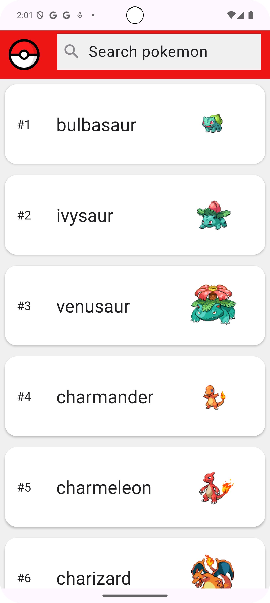
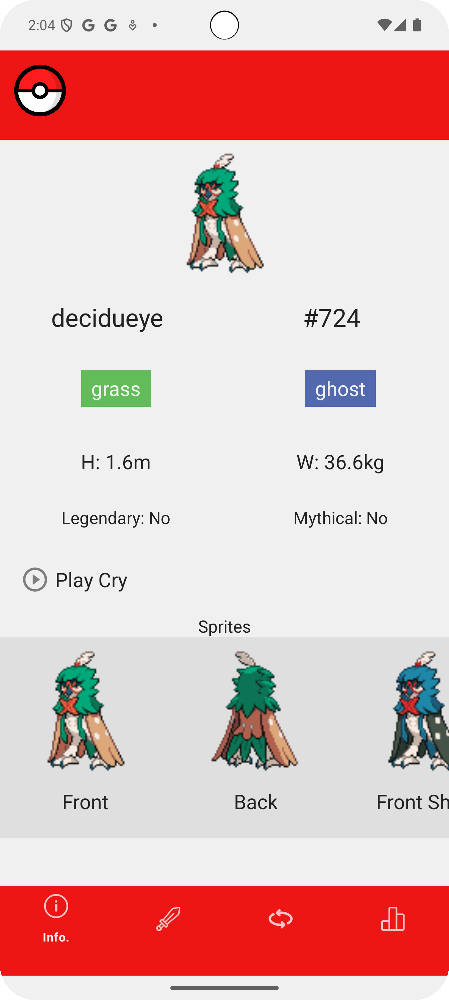
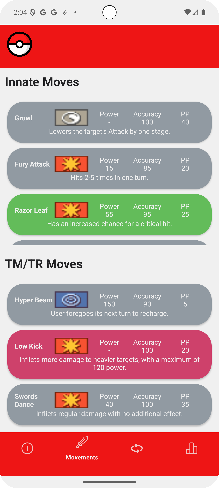
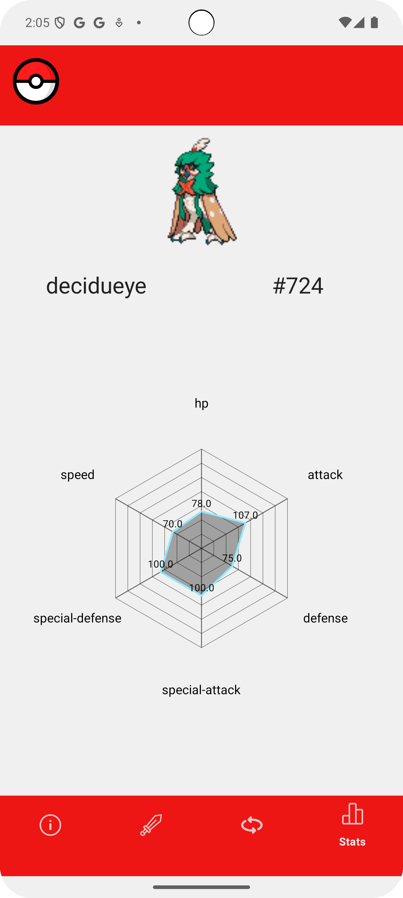

# MyDex
Simple Pokedex app for Android devices, uses PokéAPI, the RESTful Pokémon API

## Home Screen

Shows a list with all the Pokémon in the global Pokédex. Uses a MVVM architecture
to minimize API calls and provide fast response time, while providing a smooth 
user experience by seaming an endless scroll. 

## Pokémon Details
### Basic info

A minimalist screen containing basic information about the selected Pokémon, including
its name, Pokédex number, as well as types, sprites, cry and complexity-related data.

### Movements

A simple list showing each move a Pokémon is able to learn, separated in two categories,
innate moves (learned by leveling up) and TM/TR moves (can be learned by using a TM or 
TR on that Pokémon).  

Each move has the basic information shown as in the video games: its name, damage class,
power, accuracy, Power Points (PP), short description and the move type represented in
the background color of the movement.

### Stats

A simple radar chart showing the statistics of the selected Pokémon. Perfect for 
competitive-focused players who want to get the most potential of their Pokémon.

## Credits
> Resources employed in this project:  
> - [PokéAPI, the RESTful Pokémon API](https://pokeapi.co/) -> Provide all the data shown 
> in the app
> - [Gson](https://github.com/google/gson) -> Parse JSON API responses  
> - [Lottie for Android](https://github.com/airbnb/lottie-android) -> Cool animations
> - [OkHttp](https://github.com/square/okhttp) -> API call performing and management
> - [Glide](https://github.com/bumptech/glide) -> Dynamic image loading
> - [MPAndroidChart](https://github.com/PhilJay/MPAndroidChart) -> Pokémon stats